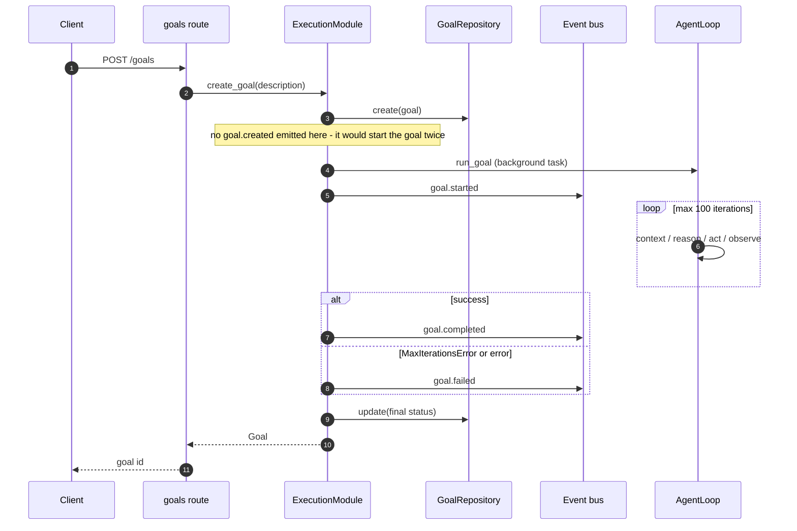

# Agentic loop

> **Current truth** for the Think → Act → Observe → Respond loop: its components,
> the decision and event contracts, the two modes, and its consumers.
> Decisions/rejected alternatives: ADR-0002 (streaming seam), ADR-0005 (typed
> parsing, superseded in part by ADR-0018), ADR-0018 (`ask_user` + token
> streaming). Module layout: [architecture.md](architecture.md).

## Sources of truth

- `CONTEXT.md` — vocabulary (`LoopEvent`, `TextDeltaEvent`, `ResponseDoneEvent`,
  drain wrapper, SSE adapter, system event).
- `docs/adr/0002`, `0005`, `0018` — why.
- `src/cortex/agentic/` — the code; this document mirrors it. **Keep in sync.**

## The cycle

`AgentLoop` (`src/cortex/agentic/loop.py`) orchestrates three injected
components and one per-caller event stream:

```
RECEIVE ─► CONTEXT ─► THINK ─► ACT ─► OBSERVE ─┐
              ▲                               │
              └─────────── iterate ◄──────────┘
                          │
                          ▼
                       RESPOND
```

1. **Context** — `ContextBuilder.build()` assembles conversation history
   (last `max_messages - 1`, default window 20), relevant facts via
   `ContextProvider.get_memory_context()` (default `max_facts=10`), tool schemas,
   personality, ambient signals, and — in goal mode — goal context.
2. **Think** — `Reasoner.reason()` (or `reason_stream()`) turns LLM output into a
   typed `Decision`: `RESPOND` or `EXECUTE_TOOLS`. Malformed output fails loudly.
3. **Act** — `LoopExecutor.execute_single()` runs each tool call, emits
   `tool_start`/`tool_done`, and returns a `ToolResult` (errors included).
4. **Observe** — results are appended to the conversation (with the assistant's
   tool-call message persisted first) and feed the next iteration.
5. **Respond** — a `RESPOND` decision emits `text` + `done`; the loop returns.

## Components

| Component | File | Contract |
|---|---|---|
| `AgentLoop` | `loop.py` | `stream_chat()`, `run_chat()` (drain), `run_goal()`; iteration caps |
| `ContextBuilder` | `context_builder.py` | `build(session_id, user_message, mode, *, goal_id, fact_types) -> Context` |
| `Reasoner` | `reasoner.py` | `reason(context) -> Decision`; `reason_stream(context) -> AsyncIterator[str \| Decision]` |
| `LoopExecutor` | `executor.py` | `execute_single(call)`, `execute_tools(calls, *, timeout, parallel)`; `max_parallel=5` |

`Decision` types (`models.py`): `RESPOND`, `EXECUTE_TOOLS`. Clarification is **not**
a decision type — the model asks by calling the `ask_user` tool, handled as an
`EXECUTE_TOOLS` turn (ADR-0018).

## The event stream (ADR-0002)

`LoopEvent` (`agentic/events.py`) is the loop's public seam to its caller. It is
caller-scoped and never published on the event bus (contrast: *system events*,
[architecture.md](architecture.md)). `event_type` **is** the wire name — no
mapping table.

| Event | `event_type` | Carries |
|---|---|---|
| `ThinkingEvent` | `thinking` | reasoning step in progress |
| `TextDeltaEvent` | `text` | a chunk of response text |
| `ToolStartEvent` | `tool_start` | tool name, call id |
| `ToolResultEvent` | `tool_done` | success, output/error, execution time |
| `AskUserEvent` | `ask_user` | question, suggested options |
| `ResponseDoneEvent` | `done` | full message, tools used, iterations, usage, latency |
| `ErrorEvent` | `error` | error text, code (`max_iterations` or `None`) |

Ordering: a `thinking` event per iteration; `tool_start`/`tool_done` per call;
`text` deltas; then `done`. Errors yield one `error` event and then re-raise the
original exception out of the generator. In stream mode the response deltas
arrive *before* the iteration's `thinking` event; consumers must tolerate both
orders.

## Modes

- **Chat** — interactive, multi-turn, may use zero tools; terminates on `RESPOND`.
  Cap: `max_chat_iterations = 20`.
- **Goal** — longer-running background task; emits `goal.status` events; can be
  paused and resumed (ADR-0004). Cap: `max_goal_iterations = 100`.

Exceeding a cap raises `MaxIterationsError`, surfaced as an `error` event with
`code="max_iterations"`.

## Stream vs drain

The loop exposes one implementation (`stream_chat`) and reduces it via the
**drain wrapper** (`run_chat`): accumulate `TextDeltaEvent` deltas (and an
`AskUserEvent`'s question) into the response text, take metadata from
`ResponseDoneEvent`, ignore progress events. Errors propagate unchanged — the
drain never swallows or rewraps them.

The **SSE adapter** (`src/cortex/api/routes/chat.py`, `POST /chat/stream`)
serializes each event to an SSE frame using `event_type` verbatim. It is explicit
about the `done` frame: `message` → `final_message`, `tools_used` → `tool_calls`.
Session lookup happens before the stream starts, so a missing session is an HTTP
404, not an in-stream error.

## Flows

### Chat turn (SSE)

```mermaid
sequenceDiagram
    autonumber
    participant C as Client
    participant RT as chat route
    participant EX as ExecutionModule
    participant RC as TraceRecorder
    participant L as AgentLoop
    participant CB as ContextBuilder
    participant CP as ContextProvider
    participant R as Reasoner
    participant LX as LoopExecutor

    C->>RT: POST /chat/stream
    RT->>EX: resolve session; stream_chat(message, trace_enabled)
    EX->>RC: capture(session_id, loop_stream)
    RC->>L: stream_chat(...)
    L->>L: seed history; persist user message
    loop until RESPOND (max 20 iterations)
        L->>CB: build(session, message, CHAT)
        CB->>CP: get_memory_context(query, max_facts)
        CP-->>CB: facts + personality + ambient
        CB-->>L: Context
        L->>R: reason_stream(context)
        R-->>L: text deltas, then Decision
        alt RESPOND
            L-->>RC: text, done
        else EXECUTE_TOOLS
            alt ask_user call
                L->>LX: execute_single(ask_user)
                L-->>RC: ask_user, done
            else normal tools
                L->>LX: execute_single(tool_call)
                LX-->>L: ToolResult
                Note over L: persist assistant tool-call then tool result
            end
        end
    end
    RC-->>EX: events (pseudonymized copy persisted; original unchanged)
    EX-->>RT: LoopEvents
    RT-->>C: SSE frames (event_type is the wire name)
```

### Goal execution



An **external** `goal.created` event instead reaches `ExecutionModule.handle_event()`
on the bus, which calls `run_goal()` in the same way. Goals left RUNNING at
shutdown are re-scheduled by `resume_in_flight()` (ADR-0004).

## Error handling

- `MaxIterationsError` — bounded loops, no runaways.
- LLM calls pass through the `CircuitBreaker` wrapper (ADR-0009); an open circuit
  surfaces as a loop error.
- Tool errors are observations, not crashes: `ToolResult.error` is fed back to the
  model, and `tool_done` reports `success=false`.

## Reliability constants

| Constant | Value | Where |
|---|---|---|
| Chat iteration cap | 20 | `AgentLoop(max_chat_iterations=20)` |
| Goal iteration cap | 100 | `AgentLoop(max_goal_iterations=100)` |
| Context window | 20 messages | `ContextBuilder(max_messages=20)` |
| Max facts per turn | 10 | `ContextBuilder(max_facts=10)` |
| Tool parallel cap | 5 | `LoopExecutor(max_parallel=5)` |
