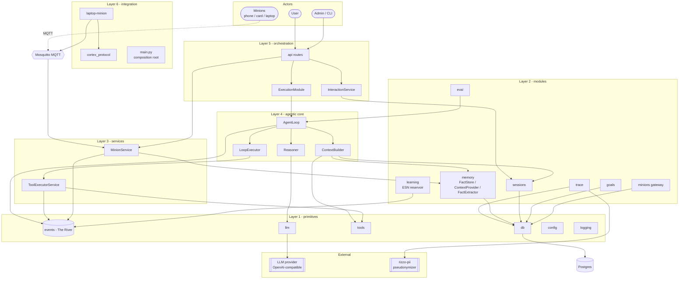
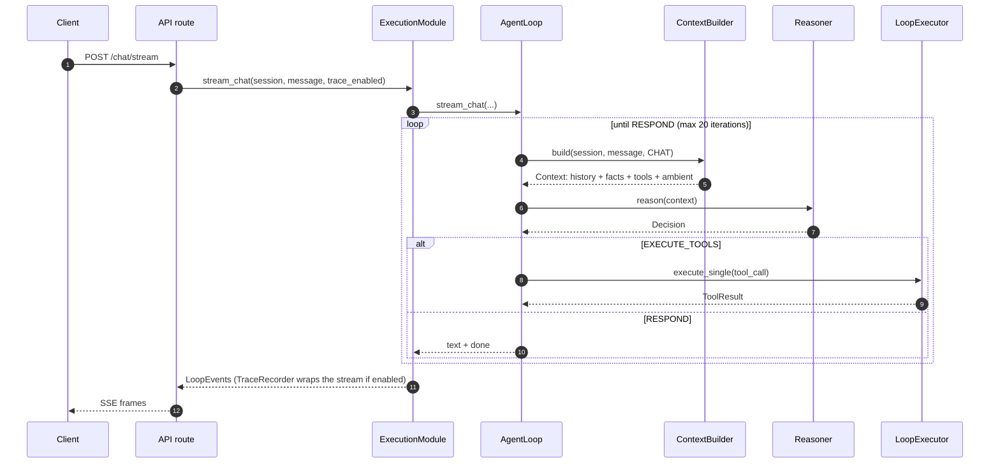
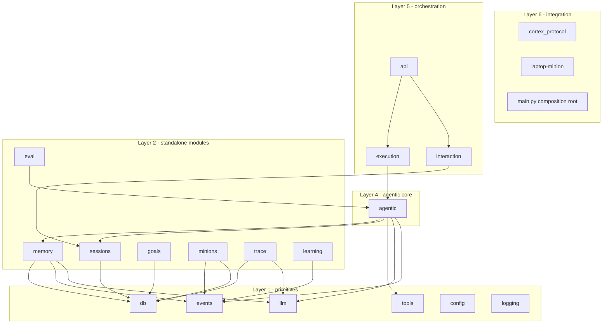

# Architecture

> **Current truth** for Cortex's module layout, event bus, persistence and deployment.
> Updated in place. Decisions (and the alternatives rejected) live in `docs/adr/`.
> Subsystems with their own spec: [agentic-loop.md](agentic-loop.md),
> [evidence-system.md](evidence-system.md), [minion-protocol.md](minion-protocol.md),
> [eval-system.md](eval-system.md), [trace-system.md](trace-system.md).

## Sources of truth

- `CONTEXT.md` — vocabulary.
- `docs/adr/` — why (decisions, rejected alternatives).
- GitHub issues — planned work, with acceptance criteria.
- This document — the system as a whole. **Keep it in sync with changes.**

## System overview

One diagram, all subsystems. Nodes are grouped by layer (see the module map
below); external systems and data stores are outside the `Cortex` layers.
Solid arrows are runtime calls; `-.` arrows are protocol/MQTT paths.

> The minion path drawn as `Edge -. MQTT .-> MQ` is **not wired end to end
> today** — see [minion-protocol.md](minion-protocol.md) § Status.
> `cortex_protocol` is the shared schema package that `laptop-minion` (and
> future phone/card minions) depend on.

Runtime at a glance — one chat turn (details in
[agentic-loop.md](agentic-loop.md), trace wrapping in
[trace-system.md](trace-system.md)):

Modules communicate by publishing and subscribing to events, not by calling each
other directly. Direct calls exist only where the composition root wires a
consumer to a producer (services, repositories).

## The River (event bus)

`src/cortex/events/`:

| Piece | Role |
|---|---|
| `EventBus` (`bus.py`) | In-memory asyncio pub/sub. Wildcard `"*"` subscriptions, per-handler error isolation, `start()`/`stop()` lifecycle. |
| `BaseEvent` / `EventMetadata` (`base.py`) | Every event carries `type`, `payload`, and metadata: `timestamp`, `source_module`, `trace_id`, `session_id`, `salience` ∈ [0,1], `correlation_id`. |
| `EventEmitter` (`emitter.py`) | Safe publish seam: never raises, tolerates a `None` bus. Every module publishes through this. |
| `EventTypes` (`types.py`) | The canonical event-name enum. |

Event types (`EventTypes`):

| Group | Names |
|---|---|
| Conversation | `user.message`, `conversation.message`, `conversation.ended` |
| Sensor | `location`, `payment`, `activity`, `calendar`, `call_log`, `app_usage` |
| Learning | `pattern.detected`, `preference.learned`, `recommendation.generated`, `recommendation.executed` |
| Tools / goals | `tool.request`, `tool.result`, `goal.created`, `goal.status`, `goal.completed`, `goal.failed`, `goal.resumed` |
| Lifecycle | `module.spawn`, `module.terminate` |
| Wildcard | `*` |

> `LoopEvent` (the agent loop's progress stream) is **not** a bus event — see
> [agentic-loop.md](agentic-loop.md).

## Module map

### Layer 0 — foundation

| Component | Path | Role |
|---|---|---|
| Config | `src/cortex/config/` | YAML + env settings (Pydantic); per-module settings models |
| Logging | `src/cortex/logging/` | structlog setup, `trace_id` propagation |
| DB | `src/cortex/db/` | asyncpg pool, `DbSession` context manager, migration runner |

### Layer 1 — primitives

| Component | Path | Role |
|---|---|---|
| Event bus | `src/cortex/events/` | The River (above) |
| LLM | `src/cortex/llm/` | Provider-agnostic `LLMClient`; `LLMClientFactory`; `CircuitBreaker` wrapper (ADR-0009) |
| Tools | `src/cortex/tools/` | `ToolRegistry` / `ToolExecutor` interfaces, `InMemoryToolRegistry`; meta tools `file_read`, `file_write`, `grep`, `shell`, `ask_user` |

### Layer 2 — standalone modules

| Module | Path | Public seam |
|---|---|---|
| Sessions | `src/cortex/sessions/` | `SessionRepository`; lifecycle free functions in `policy.py` (`create_session`, `resume_session`, `add_user_message`, `end_session`, `get_or_create_session`, ADR-0011) |
| Memory | `src/cortex/memory/` | `FactStore` (CRUD + dedup), `ContextProvider` (bundle seam, personality/ambient), `FactExtractor` (ingestion); split from `MemoryService` per ADR-0003 |
| Goals | `src/cortex/goals/` | `GoalRepository`, persistent/resumable goals (ADR-0004) |
| Minions | `src/cortex/minions/` | `MinionGateway`, `MinionRegistry`, `MinionEventHandler`; `MinionMQTTClient`. See [minion-protocol.md](minion-protocol.md) |
| Trace | `src/cortex/trace/` | `TraceRepository`, `TraceRecorder`, `Pseudonymizer`, `audit`. See [trace-system.md](trace-system.md) |
| Eval | `src/cortex/eval/` | fixtures, runner, grader, judge, metrics, baseline, gate. See [eval-system.md](eval-system.md) |
| Learning | `src/cortex/learning/` | Echo State Network (`reservoir.py`), per-target readouts, `encoding.py`, `module.py` (ADR-0001) |

### Layer 3 — services

| Service | Path | Role |
|---|---|---|
| `ToolExecutorService` | `src/cortex/services/tool_executor.py` | Tool execution with circuit breaker, event emission, metrics |
| `MinionService` | `src/cortex/services/minion_service.py` | MQTT gateway → facts/events on the bus |

### Layer 4 — agentic core

`src/cortex/agentic/` — `ContextBuilder`, `Reasoner`, `LoopExecutor`, `AgentLoop`.
Full contract in [agentic-loop.md](agentic-loop.md).

### Layer 5 — orchestration

| Component | Path | Role |
|---|---|---|
| `ExecutionModule` | `src/cortex/execution/module.py` | Goal lifecycle events; chat/goal entry points; wires the trace consumer around the loop |
| `InteractionService` | `src/cortex/interaction/service.py` | Thin I/O facade over session policy |
| API | `src/cortex/api/` | FastAPI app, auth, routes |

### Layer 6 — integration

| Component | Path | Role |
|---|---|---|
| `cortex-protocol` | `src/cortex_protocol/` | Shared, language-agnostic minion schemas + MQTT topics; separate distributable package |
| `laptop-minion` | `laptop-minion/` | Standalone laptop sensor agent (own `pyproject.toml`, tests) |
| Composition root | `src/cortex/main.py` | `initialize_app()` wires everything |

## Dependency direction

`memory` does not import `agentic`. Consumers reach Memory through the
`ContextProvider` bundle seam, never through raw SQL or `MemoryService`
(the class no longer exists — ADR-0003).

## Composition root

`initialize_app()` in `src/cortex/main.py` applies migrations, then wires in order:
sessions → goals → trace → memory → LLM factory → tool registry →
`ToolExecutorService` → `ContextBuilder`/`Reasoner`/`LoopExecutor`/`AgentLoop` →
`ExecutionModule` → `InteractionService` → optional `MinionService`. Repositories
and services are injected; the agentic core constructs nothing itself.

## Persistence

Migrations in `migrations/` (raw SQL, applied by `src/cortex/db/migrations/runner.py`):

| Table | Holds |
|---|---|
| `sessions`, `messages` | Conversation state that feeds context building |
| `facts`, `concepts` | Memory: typed facts (payload + confidence + layer) and derived concepts |
| `goals`, `goal_steps` | Persistent, resumable goals |
| `minions` | Registered minions, state, last heartbeat |
| `api_keys` | Admin API tokens (hashed) |
| `loop_events` | Pseudonymized runtime traces (ADR-0017) |

## API surface

FastAPI routes under `src/cortex/api/routes/`: `chat` (POST `/chat`, POST
`/chat/stream`), `sessions`, `goals`, `minions` (admin), `admin_auth`, `health`.
SSE wire contract for `/chat/stream` is in [agentic-loop.md](agentic-loop.md).

## Deployment

`docker-compose.yml`:

| Service | Image | Notes |
|---|---|---|
| `postgres` | `postgres:16-alpine` | Port 5432 |
| `mosquitto` | `eclipse-mosquitto:2` | Port 1883; broker config in `docker/mosquitto.conf` |
| `cortex` | built from `Dockerfile` | Port 8000; depends on healthy postgres + mosquitto |
| `rizzo-pii` | pinned upstream `Rizzo-AI-Academy/rizzo-pii@v2.0.0` | Opt-in `--profile trace`; pseudonymization sidecar for trace capture |

CLI (`cortex <command>`, `src/cortex/cli.py`): `token:create`, `traces:cleanup`,
`version`.

## Configuration

`config.yaml` sections (env overrides win): `database`, `llm` (provider, model,
base_url, timeout), `trace` (sidecar URL, timeout, retention), `mqtt`
(broker_url, keepalive, reconnect), `app` (host, port), `logging`.
Per-module LLM settings are composed (ADR-0010).

## Testing and CI

`tests/` mirrors `src/` plus `tests/eval/` (the eval suites) and `tests/integration/`.
CI: `.github/workflows/ci.yml` (lint + unit), `.github/workflows/eval.yml`
(eval gate, see [eval-system.md](eval-system.md)).
