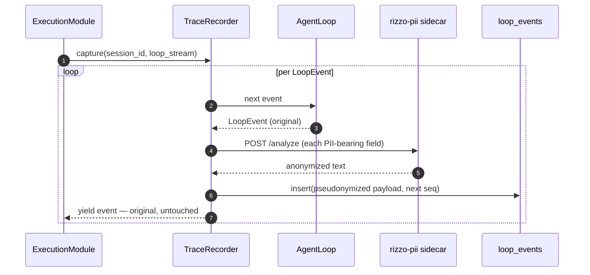

# Trace system

> **Current truth** for opt-in runtime trace capture and audit. Decision and
> rationale: ADR-0017. Terminology: `CONTEXT.md` (Trace, Trace Recorder, PII
> Gateway, Alias dictionary, pre/post hook).

## Sources of truth

- `CONTEXT.md` — vocabulary.
- `docs/adr/0017-runtime-trace-capture.md` — why; scope boundary vs the PII gateway.
- GitHub issues #111–#114 — the work.
- This document — the system as a whole. **Keep it in sync.**

## What a trace is

The persisted, opt-in record of one session's LoopEvent stream (`thinking`,
`text`, `tool_start`, `tool_done`, `ask_user`, `done` + usage/latency, `error`),
stored **pseudonymized** so it carries no real PII. Distinct from:

- the **conversation** (`messages` table), which feeds the context builder and
  keeps real data;
- a **transcript** (the in-memory `Sequence[LoopEvent]` the judge consumes).

## Capture

- Opt-in **per session**: `sessions.trace_enabled` (default off).
- `ExecutionModule.stream_chat()` resolves the flag and, when true **and** a
  `TraceRecorder` was injected at the composition root, wraps the loop's
  async-generator stream with `recorder.capture(session_id, loop_stream)`. Without
  an injected recorder, trace-enabled turns run untraced (pure passthrough); the
  loop itself is never modified.
- The recorder is a **consumer** of the stream: for each event it builds the
  `to_dict()` payload, pseudonymizes PII-bearing string fields via the injected
  `Pseudonymizer` (one `POST /analyze` per non-empty field), replaces them in the
  **stored copy only**, and persists the pseudonymized payload with the next
  monotonic `seq`. The original event is re-yielded untouched.
- Capture is **fail-closed** with respect to the caller: a sidecar or storage
  failure never alters or interrupts the user's stream.

## Pseudonymization

`Pseudonymizer` is a one-method interface (`anonymize(text) -> str`) so capture
code is sidecar-agnostic. Production uses the local `rizzo-pii` sidecar
(`config.yaml: trace.sidecar_url`, default `http://127.0.0.1:5005`, opt-in via
`docker compose --profile trace`). The client always sends `include_mapping=false`,
so **real values never leave the sidecar**; placeholders are stable `[TAG_N]`
within one request and the alias dictionary stays on the user's machine — never in
the Cortex DB, never sent to any API model.

## Storage

`loop_events` table (migration `007_traces.sql`), one row per event: session id,
monotonic `seq`, wire `event_type`, and the event's self-describing `to_dict()`
JSON as an **opaque** `payload`. `TraceRepository` treats the payload as opaque —
it has no field knowledge of individual event types. Implementations: Postgres.
`max_seq(session_id)` supports resume-after-restart; `delete_older_than(cutoff)`
supports retention.

## Audit

`trace/audit.py` is the read side (`audit_session`):

1. reconstructs the typed `LoopEvent` sequence from stored payloads (seq order,
   `event_type` dispatch over all seven event classes, including usage/latency
   round-trip);
2. describes the session to the Trajectory Judge using its FIRST user turn
   (fetched via `SessionRepository` and pseudonymized through the same sidecar);
3. re-pseudonymizes stored-raw `ErrorEvent.error` text, so no real PII reaches the
   judge.

A captured trace is judged for **diagnosis and partial credit only**. The
pass/fail oracle remains the annotated goal state — the judge never emits
pass/fail (ADR-0015 extended to runtime traces by ADR-0017).

## Retention

`traces:cleanup` (`cortex traces:cleanup`) deletes rows older than
`trace.retention_days` (default 30, `config.yaml`) via
`TraceRepository.delete_older_than`.

## Scope boundary — not the PII gateway

This system pseudonymizes **only at trace persistence**, not at the LLM boundary.
Anonymizing every model call and restoring responses (the **PII Gateway**) is a
separate feature (issue #106) and needs a pre/post-hook seam around LLM calls
that Cortex does not yet have. The `messages` table keeps real conversation data;
it never leaves the machine, and only the audit artifact is pseudonymized.

## Privacy invariants (ADR-0017)

1. PII is pseudonymized at persistence — neither the DB nor the judge sees real
   PII; the alias dictionary stays local.
2. Traces are opt-in per session.
3. Traces are never fed back into prompts, context, training, or the learning
   loop (the Golden Set privacy rule extended to runtime traces).
